# Predicting and Phenotyping Sleep Health in a Diverse National Cohort: Evidence from the *All of Us* Research Program

**Sophia Boettcher, Auston Balwinski, Hunter Belous, Jared Fox**  
School of Information, University of Michigan  
SIADS 699 Capstone Project — August 2026

---

## Abstract

We used wearable data from 45,259 All of Us participants (CDR v9) to predict sleep duration and consistency from sociodemographic, health, and activity features. Histogram gradient boosting reached R² = 0.277 on consistency, an 11% gain over a regularized linear model and well outside fold-to-fold variation. On duration the two tied at 0.104 and 0.103 suggesting the limit is missing variables rather than model form. Activity irregularity was the dominant consistency signal. KMeans identified four sleep phenotypes. Stratified evaluation surfaced two equity failures on two targets: consistency accuracy is 40% and 41% lower for Black and Asian participants than White participants, while duration accuracy falls 77% from the youngest age band to participants 81 and over. These findings point to activity regularity as a modifiable sleep determinant, and show that predictive accuracy is unevenly distributed across demographic subgroups.

**Keywords:** sleep health, wearables, All of Us, machine learning, health equity, Fitbit, phenotyping

---

## 1. Introduction

Sleep is a pillar of health, co-equal with nutrition and physical activity in its influence on chronic disease risk and cognitive function, yet it remains poorly integrated into clinical workflows and health equity research. Adults in the United States average fewer than the recommended seven to nine hours a night, with substantial disparities across racial, socioeconomic, and geographic groups (Pankowska et al., 2023).

Two things about sleep matter: duration, how much someone sleeps, and consistency, how much that varies night to night. All of Us lets us study both at scale, on a deliberately broad cohort with linked surveys, health records, and wearable data (Patten et al., 2026). We ask three questions:

1. **Prediction.** How well do sociodemographic, behavioral, and health characteristics predict sleep duration and consistency?
2. **Phenotyping.** What sleep behavioral phenotypes emerge from unsupervised clustering?
3. **Fairness.** How equitably do the models perform across racial/ethnic and age groups?

We set three criteria before running anything. A model has to beat a mean-predicting baseline; its feature attributions count only if they survive leakage and collinearity audits; and its accuracy has to hold within demographic strata, not just in aggregate. This project meets them with mixed success. The models beat baseline and their attributions hold up to examination, but accuracy varies substantially across racial/ethnic and age groups.

---

## 2. Background

Sleep under six hours is robustly associated with obesity, type 2 diabetes, and cardiovascular disease through bidirectional pathways: insufficient sleep disrupts hormonal regulation, while metabolic disease fragments sleep architecture (Patel & Hu, 2008). Because both short and long durations carry adverse cardiometabolic profiles (St-Onge et al., 2016), duration and consistency deserve modeling as parallel outcomes.

Wearables enable passive measurement outside the clinic, and the All of Us resource is among the largest of its kind (Patten et al., 2026). The devices are not perfect, though: they overestimate total sleep time and detect wake-after-sleep-onset poorly (Chinoy et al., 2021), and consistent wearers differ from non-wearers. Machine learning on population-scale accelerometry is established (Walmsley et al., 2022), and boosted trees typically outperform linear models on structured health data (Chen & Guestrin, 2016). Clustering-based sleep phenotyping has identified subtypes aligning with self-reported outcomes (Hartmann & Prichard, 2018), but largely in White, college-educated samples, and rarely with subgroup fairness evaluation attached. That gap is what this project targets.

---

## 3. Data and Methods

### 3.1 Data source and cohort

Data came from the All of Us Controlled-Access Dataset v9 (National Institutes of Health, 2026) through the Researcher Workbench, principally the Fitbit sleep daily summary table. Cleaning kept main-sleep nights of four to twelve hours from 2017 onward, the year Fitbit adopted PPG-based staging visible as a step change in mean sleep and its variability (Appendix A.2). We also required at least four valid nights per participant and at least 70% night-level validity, leaving 48,688 participants and 30.6 million nights.

A second floor followed from the outcome's definition rather than from its effect on any score. Consistency is a within-person standard deviation, so its precision depends on the number of nights behind it: below 30 nights, over a quarter of the target's variance is estimator noise (Appendix A.1). Restricting to at least 30 valid nights gives a final cohort of 45,259, 93% of the extract. Both floors are applied during extraction, so the analysis frame is already the analytic cohort.

| Characteristic | Value |
|---|---|
| N | 45,259 |
| Mean age | 56.7 years |
| Female | 66.6% |
| White | 70.1% |
| Hispanic / Black / Multiracial / Asian | 10.8 / 6.0 / 5.6 / 4.7% |
| Mean sleep duration | 6.89 hours/night |
| Mean nights under 6 hours | 25.4% |
| Mean daily step count | 7,081 steps |
| Mean BMI | 29.4 |

### 3.2 Outcomes, features, and two selection rules

The outcomes are duration, a participant's mean nightly hours, and consistency, the SD of those hours, where lower means more regular. Features were aggregated to one row per participant, so no night-level record can straddle a cross-validation fold. The final contract is nine numeric columns plus eight one-hot dummies:

- **Sociodemographic:** age, education, income tier, employment; gender and race/ethnicity as dummies
- **Health:** BMI, self-rated health
- **Physical activity:** log daily steps, and a step coefficient of variation (SD ÷ mean) isolating activity irregularity from volume
- **Wearable engagement:** valid nights tracked, a control rather than a determinant

Two rules produced that list: 
- **Leakage:** any column computed from the same nightly distribution as the targets was excluded; a model handed the interquartile range of nightly sleep predicts a variance target largely from itself. Nights tracked survives because it counts nights rather than summarizing durations. 
- **Collinearity:** no pair above |*r*| = 0.9 survived, because a model given both members uses their difference as a feature and its coefficients then belong to that difference. The prune took the largest pairwise correlation from 0.99 to 0.53 and the condition number from 24.5 to 5.2. Interactions were screened against the full feature set and none earned a column.

### 3.3 Modeling and evaluation protocol

Four estimators were compared: a mean-predicting baseline, Ridge, a random forest, and histogram gradient boosting, all from scikit-learn. Every model was scored on the identical feature matrix, so any spread in the results belongs to the estimator rather than its inputs.

Scoring used 5-fold cross-validation (KFold, shuffled, fixed seed). The frame is one row per participant, so no split places the same person on both sides, and imputation and scaling sit inside Pipeline objects learned within each fold from its training half alone (BMI is the only feature with meaningful missingness, at 9.1%). Fold-to-fold RMSE variation is reported alongside the mean. A 20% split withheld from feature selection checks for selection optimism (Appendix A.3).

Feature effects are read two ways: Ridge coefficients on standardized features for direction, permutation importance on held-out data for reliance.

### 3.4 Phenotyping and fairness auditing

**Phenotyping.** KMeans was applied to a standardized matrix of four sleep behavior columns: mean nightly sleep, the within-person SD, and the shares of nights under six and over nine hours. Demographics and activity were described afterwards rather than fitted, so the clusters partition sleep behavior alone. Values of k from 2 to 8 were scored by inertia and silhouette with k=4 chosen (Appendix A.5).

**Fairness.** Subgroups were scored with out-of-fold R², so every participant is evaluated by a model that did not train on them. Strata are race/ethnicity and age band, both audited and neither fitted; subgroups under 100 participants were not scored. R² was preferred to raw error, which by subgroup largely tracks that subgroup's own outcome variance. Appendix A.6 explains why we do not use the All of Us Underrepresented in Biomedical Research flag. Since R² = 1 − MSE/Var(group), a group whose outcome varies less must be predicted more precisely to score the same, so compare groups within a stratum rather than to the pooled figure.

---

## 4. Results

### 4.1 The cohort's sleep

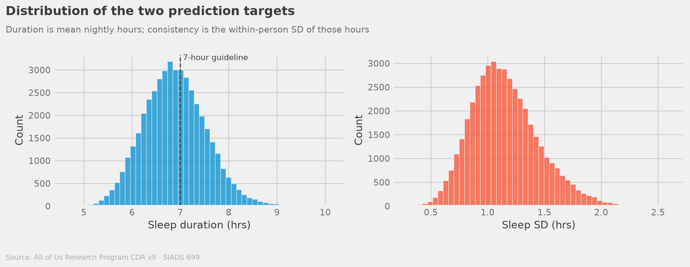

*Figure 1. The two outcomes. Duration centers just below the seven-hour guideline at 6.89 hours; consistency, the within-person SD, averages 1.15 hours.*

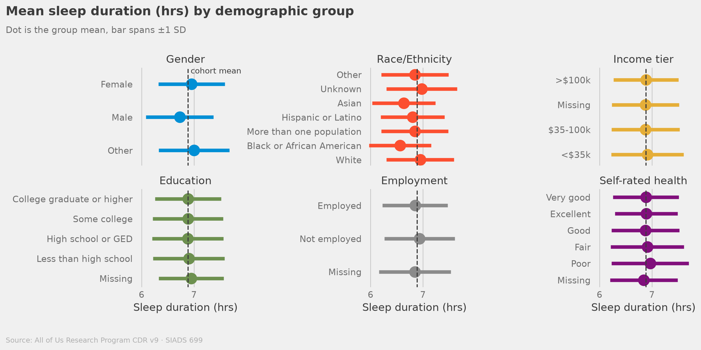

*Figure 2. Mean duration by demographic level, bars spanning ±1 SD.*

A quarter of all retained nights fall under six hours. But demographic differences in duration are small relative to the spread within each group — the ±1 SD bars in Figure 2 overlap almost completely, which sets expectations for what any model on these variables can achieve.

### 4.2 The two targets diverge

| Model | Duration R² | Duration RMSE ± SD | Consistency R² | Consistency RMSE ± SD |
|---|---|---|---|---|
| Baseline (mean) | −0.000 | 0.646 ± 0.009 | −0.000 | 0.296 ± 0.002 |
| Ridge | 0.103 | 0.612 ± 0.005 | 0.250 | 0.257 ± 0.001 |
| Random Forest | 0.095 | 0.615 ± 0.007 | 0.269 | 0.253 ± 0.002 |
| HistGBM | **0.104** | 0.612 ± 0.006 | **0.277** | 0.252 ± 0.002 |

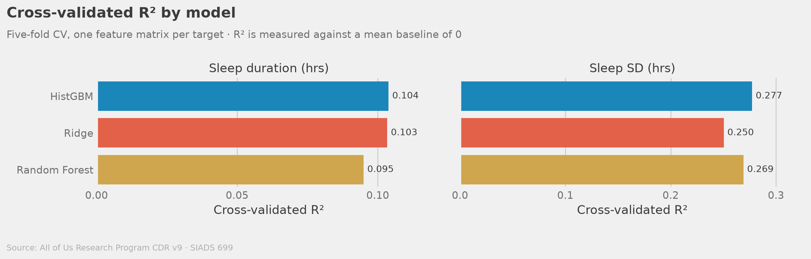

*Figure 3. Cross-validated R² by model, one panel per target.*

Both targets clear the baseline. Beyond that they answer differently, and the fold SDs make the difference legible.

On consistency boosting is worth having: 0.277 against Ridge's 0.250 is an 11% relative gain, and in RMSE it moves 0.2566 to 0.2520, roughly three times either model's fold variation. There is likely nonlinear structure the linear model does not reach.

On duration the two are indistinguishable: HistGBM leads by 0.0005 R², against fold SDs an order of magnitude larger. Where a boosted tree extracts nothing a linear model misses, the constraint is the information in the columns.

Two checks say the modest R² is real unexplained variance: held-out scores land slightly above the cross-validated figures in all four combinations (Appendix A.3), and out-of-fold predictions are unbiased to within 0.016 hours (Appendix A.4).

### 4.3 What predicts what

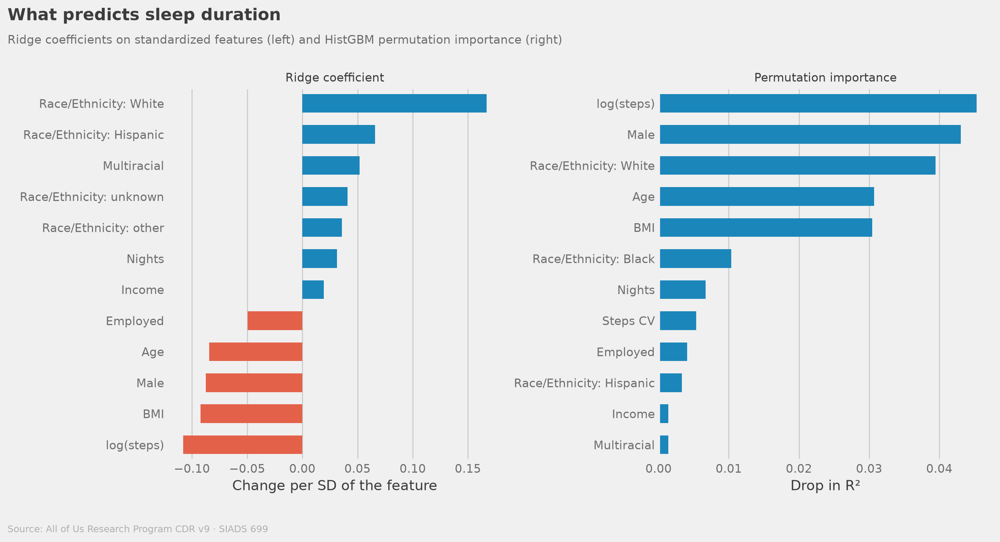

*Figure 4. Ridge coefficients (left) and HistGBM permutation importance (right) for sleep duration.*

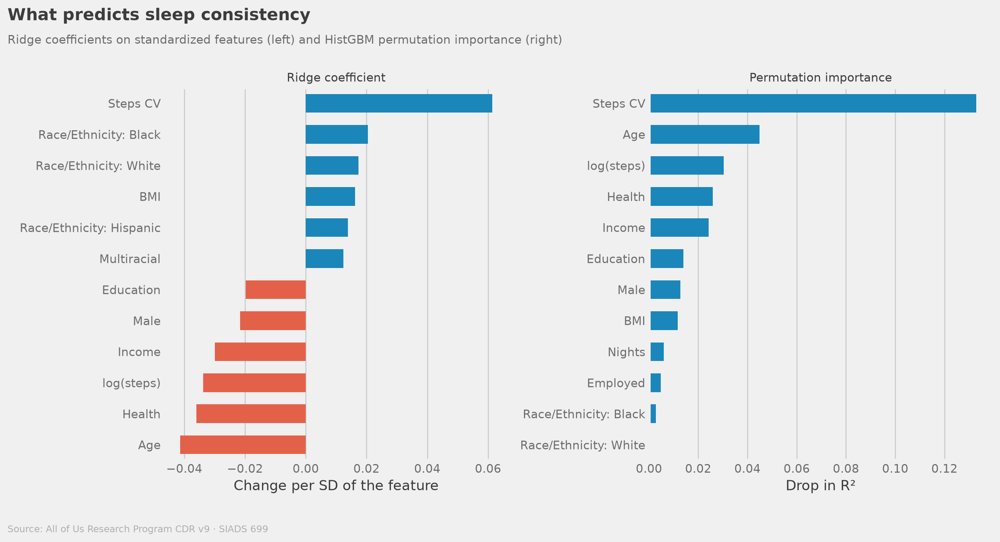

*Figure 5. Ridge coefficients (left) and HistGBM permutation importance (right) for sleep consistency.*

The targets lean on different features. Duration is carried by person-level attributes: activity level (permutation importance 0.045), male gender (0.043), White race/ethnicity (0.039), age (0.031), BMI (0.030). Consistency is carried by activity, with the step coefficient of variation at 0.133, roughly three times the next feature down, age (0.045), followed by activity level (0.030).

No wear-time column appears in either top four; nights tracked scores 0.007 on duration making it a control rather than a finding. And the activity–consistency relationship is curved rather than age-moderated: if activity stabilized sleep more for older people the slope of consistency on steps would steepen with age, but it holds flat across age quartiles. The log form outperforms raw steps, and no interaction term earned a column.

### 4.4 Four sleep phenotypes

| Cluster | N | % | Mean sleep (hrs) | SD | Nights < 6h | Mean steps | Mean BMI |
|---|---|---|---|---|---|---|---|
| Consistent Good Sleepers | 17,796 | 39.3% | 7.13 | 0.95 | 12% | 7,788 | 27.6 |
| Short but Regular | 12,186 | 26.9% | 6.13 | 1.07 | 47% | 7,472 | 30.4 |
| Chronic Short & Variable | 10,703 | 23.6% | 6.89 | 1.44 | 29% | 6,181 | 30.8 |
| Variable Long Sleepers | 4,574 | 10.1% | 7.97 | 1.48 | 11% | 5,386 | 30.0 |

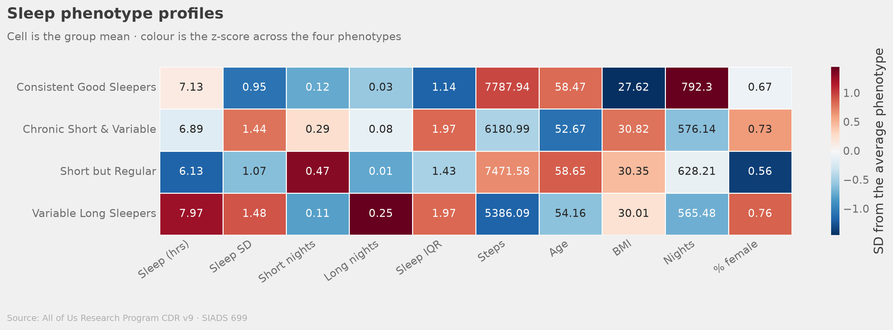

*Figure 6. Cluster means. Color is the column z-scored across phenotypes; numbers are raw means.*

- **Consistent Good Sleepers** (39%) pair adequate duration with the lowest variability, highest activity, and lowest BMI. 
- **Short but Regular** (27%) sleep least of any group with 47% of nights under six hours, but on a predictable schedule. 
- **Chronic Short & Variable** (24%) sit at the cohort's mean duration with the highest variability, the most nights at both extremes, the highest BMI, and the youngest mean age, which potentially identifies them as an at-risk group.
- **Variable Long Sleepers** (10%) are the least active by a wide margin.

We take k = 4 over the silhouette's preferred k = 3 for the split it adds, which separates the short sleepers into a regular and a variable group (Appendix A.5). Participants form one continuous cloud that does not have natural boundaries, so someone near a boundary is not meaningfully in either group.

### 4.5 Two equity failures, on two targets

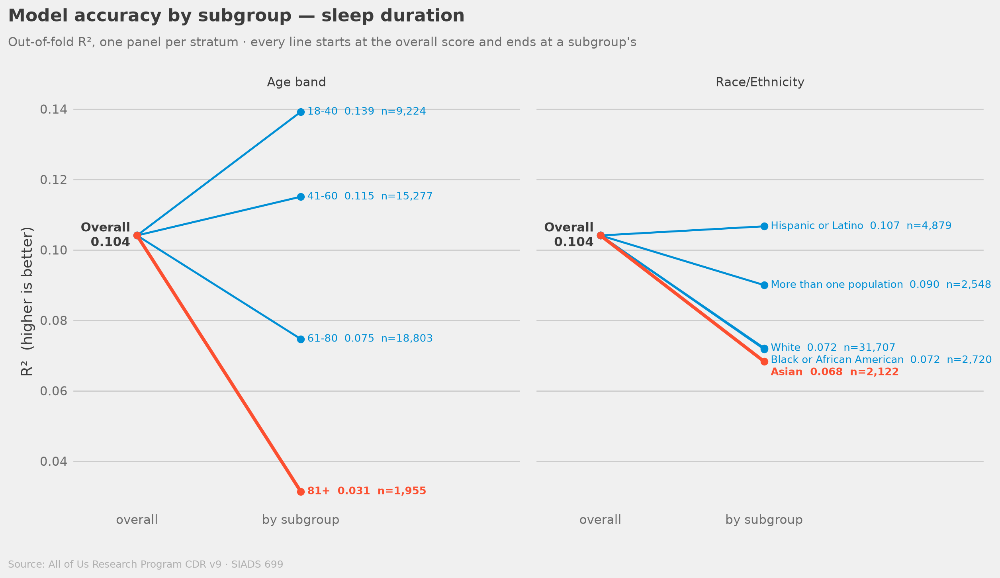

*Figure 7. Out-of-fold R² by subgroup for sleep duration.*

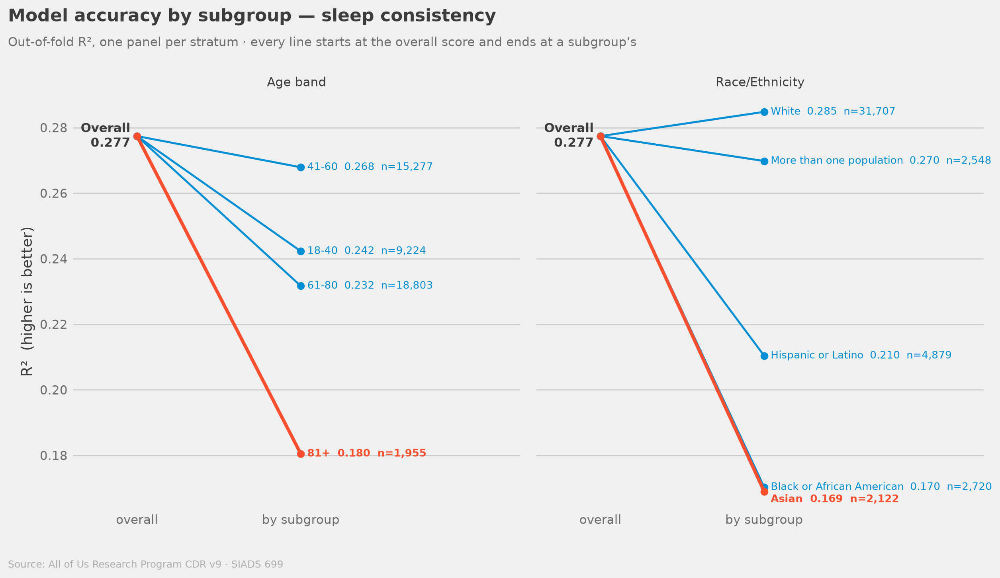

*Figure 8. Out-of-fold R² by subgroup for sleep consistency.*

The largest disparity is by age, on duration, where accuracy declines monotonically from 0.139 in the youngest band to 0.031 for participants 81 and over. An age effect appears on consistency too, but not in the same shape: accuracy peaks at 41–60 (0.268) and falls to 0.180 for the oldest band.

The two targets differ in the pattern of their racial gaps more than in their size. On consistency the ordering is graded against White participants, who score highest (0.285) with Black (0.170) and Asian (0.169) participants roughly 40% below them. On duration that ordering disappears: White participants (0.072) sit level with Black participants (0.072) and well below Hispanic or Latino participants, who score highest (0.107).

There are three main potential explanations, and this analysis cannot separate them: training-data composition, unmeasured confounders differing across groups, and wearable staging validated primarily in younger and lighter-skinned populations.

---

## 5. Discussion

### 5.1 Interpreting the predictive findings

The R² values here are modest and consistent with the machine learning sleep prediction literature. Duration is shaped by biological, social, and environmental determinants, many absent from standard surveys, and the ceiling near R² = 0.10 reflects that absence rather than model inadequacy, supported by the calibration check.

The Ridge–HistGBM tie on duration is informative, suggesting that the estimator architecture is not the limitation, but further features could be. Consistency is the opposite case where gradient boosting is worth 11%, and the dominant signal, irregular daily activity, is unlike age or race in being behavioral and in principle modifiable. This could potentially be used as a signal of intervention since consistent activity is a modifiable behavior.

### 5.2 Broader impacts and ethical considerations

Four groups stand to be affected: the roughly 10,700 participants in the flagged Chronic Short & Variable phenotype whom outreach could target; clinicians and public health programs; researchers reusing this cohort who inherit the feature contract and the subgroup gaps; and device manufacturers, whose staging algorithms are validated unevenly.

The central ethical problem is that a group-blind screen built on this model would look fair while being unequally accurate. Nothing in the pipeline uses race, yet consistency accuracy is 40% lower for Black and 41% lower for Asian participants than White participants. A program using it to decide whom to contact would identify candidates most reliably in the group it already serves best, while satisfying every check that inspects only the inputs. That is the case for auditing outcomes by subgroup at deployment, and for reporting more than one stratum: an age-only audit would have missed the racial gap, a race-only audit the age gradient.

Two narrower concerns follow. First, participants consented to research use of their data under protections that extend to derivable aggregates, not to being individually scored and ranked; any operational use of a model like this needs its own consent basis. Second, the phenotype names label cuts through a continuous distribution, so they should not be read as medically meaningful categories without further examination.

### 5.3 Limitations

1. **Cross-sectional design.** Features were aggregated without temporal ordering, so no causal claim is supported.
2. **Unequal exposure.** Nights tracked ranges from 30 to 2,784, so the duration target averages a month for some participants and years for others, while each contributes one equally weighted row.
3. **Measurement and selection bias.** Fitbit estimates are bounded by device algorithms, and the non-wearing population differs from the analytic cohort.
4. **Absent determinants.** Shift work, neighborhood noise and light, partner disturbance, caffeine and alcohol, resting heart rate, and chronic conditions are all missing; the calibration check indicates these absences, not model bias, explain the unexplained variance.
5. **Subgroup sample sizes.** The groups with the largest shortfalls are among the smallest — 2,720 Black, 2,122 Asian, and 1,955 participants 81 or over — making subgroup-specific models a priority.

---

## 6. Conclusion

Across 45,259 All of Us participants we predicted sleep duration and consistency from one audited feature set and compared four model classes on identical inputs. Boosting improves consistency prediction by 11% and duration prediction not at all, locating the duration predicting limit in absent measurements rather than model form. Activity irregularity is the dominant consistency signal, and its relationship to sleep is curved rather than age-moderated. Four phenotypes describe the cohort's sleep behavior, though they are cuts through a continuous distribution rather than natural clusters.

The most consequential finding is that stratified evaluation locates two distinct equity problems, on two targets, affecting largely different people. Future work should prioritize longitudinal modeling, subgroup-stratified development, neighborhood-level social determinants, and co-design with the Chronic Short & Variable population. Platforms like All of Us deliver on their promise only with methods that work for all participants, not only the demographic majority.

---

## Statement of Work

**Sophia Boettcher** led the Researcher Workbench setup, the development structure, the initial queries and models, and the Streamlit dashboard. **Auston Balwinski** managed the project and refined and documented the queries and models across both notebooks. **Hunter Belous** and **Jared Fox** led the visualization, figure, presentation work. All four shared project conception, scoping, and the writing and refinement of the deliverables.

---

## References

Chen, T., & Guestrin, C. (2016). XGBoost: A scalable tree boosting system. In *Proceedings of the 22nd ACM SIGKDD International Conference on Knowledge Discovery and Data Mining* (pp. 785–794). https://doi.org/10.1145/2939672.2939785

Chinoy, E. D., Cuellar, J. A., Huwa, K. E., Jameson, J. T., Watson, C. H., Bessman, S. C., Hirsch, D. A., Cooper, A. D., Drummond, S. P. A., & Markwald, R. R. (2021). Performance of seven consumer sleep-tracking devices compared with polysomnography. *Sleep*, *44*(5), zsaa291. https://doi.org/10.1093/sleep/zsaa291

Hartmann, M. E., & Prichard, J. R. (2018). Calculating the contribution of sleep problems to undergraduates' academic success. *Sleep Health*, *4*(5), 463–471. https://doi.org/10.1016/j.sleh.2018.07.002

National Institutes of Health. (2026). *All of Us Research Program Controlled Tier Dataset v9*. NIH All of Us Research Program. https://www.researchallofus.org

Pankowska, M. M., Lu, H., Wheaton, A. G., Liu, Y., Lee, B., Greenlund, K. J., & Carlson, S. A. (2023). Prevalence and geographic patterns of self-reported short sleep duration among US adults. *Preventing Chronic Disease*, *20*, Article 220400. https://doi.org/10.5888/pcd20.220400

Patel, S. R., & Hu, F. B. (2008). Short sleep duration and weight gain: A systematic review. *Obesity*, *16*(3), 643–653. https://doi.org/10.1038/oby.2007.118

Patten, T., Preble, E. A., Master, H., Adjemian, J., Ramirez, A., McClain, J., & Price, A. R. (2026). The *All of Us* Research Program's wearables dataset. *Nature Medicine*, *32*(6), 2302–2310. https://doi.org/10.1038/s41591-026-04352-3

St-Onge, M. P., Grandner, M. A., Brown, D., Conroy, M. B., Jean-Louis, G., Coons, M., & Bhatt, D. L. (2016). Sleep duration and quality: Impact on lifestyle behaviors and cardiometabolic health. *Circulation*, *134*(18), e367–e386. https://doi.org/10.1161/CIR.0000000000000444

Walmsley, R., Chan, S., Smith-Byrne, K., Ramakrishnan, R., Woodward, M., Rahimi, K., Dwyer, T., Bennett, D., & Doherty, A. (2022). Reallocation of time between device-measured movement behaviours and risk of incident cardiovascular disease. *British Journal of Sports Medicine*, *56*(18), 1008–1017. https://doi.org/10.1136/bjsports-2021-104050

---

*All analyses were conducted in the All of Us Researcher Workbench (Terra). No individual-level data are reported or shared. Aggregate statistics reported herein have been reviewed in accordance with All of Us data use policies.*

---
---

# Appendix

Appendix A records the methodological work the body summarizes in a clause; Appendix B documents how data moved from BigQuery to the published artifacts; Appendix C is the AI use statement.

---

## Appendix A — Methodological asides

### A.1 Where the 30-night floor comes from

`target_sleep_consistency` is a within-person standard deviation, which makes it an estimate whose
precision depends on how many nights produced it. The sampling variance of an SD from n
observations is approximately σ²/2(*n*−1). Comparing that quantity to the observed variance of the
target gives the share of what a model would be asked to predict that is measurement noise:

| Nights tracked | N | Var(target) | Est. noise var | Noise share |
|---|---:|---:|---:|---:|
| 4–10 | 1,080 | 0.2702 | 0.1433 | **53%** |
| 11–30 | 2,457 | 0.1505 | 0.0439 | 29% |
| 31–100 | 5,133 | 0.1090 | 0.0136 | 12% |
| 101–365 | 13,858 | 0.0931 | 0.0035 | 4% |
| 366+ | 26,160 | 0.0768 | 0.0008 | 1% |

At 4–10 nights over half the target is noise. The threshold comes from this table rather than from its
effect on any score — choosing an inclusion rule by watching R² move is a way of fitting the cohort to
the model.

The restriction does not reshape the cohort. Every descriptive statistic is within a point of where it
started, so what ≥30 nights removes is imprecise target estimates rather than a particular kind of
participant.

The two floors have to be applied in that order. The looser one (`MIN_EXTRACT_NIGHTS = 4`, which
decides which nights enter the cleaned frame) is what keeps the sub-30-night participants around long
enough for the table above to be computed; the stricter one (`MIN_MODEL_NIGHTS = 30`, which decides
whose targets are precise enough to model) is then applied on top. Both run inside
`data_extraction.ipynb`, so revisiting either threshold means re-running the extraction — which is
also where the evidence for both of them lives.

### A.2 Why the analysis window starts at 2017

Fitbit introduced PPG-based sleep staging in 2017. Both mean nightly sleep and nightly SD step down
across that boundary: 2016 averaged 6.65 hours at an SD of 1.96, 2017 averaged 6.54 at 1.86. Nights on
either side are not measurements of the same quantity by the same instrument.

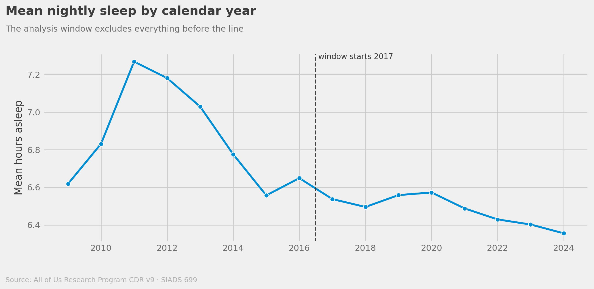

*Figure A1. Mean nightly sleep and its variability by calendar year. The pre-2017 years are also
thin: 2009–2016 contribute 8.5% of nights from fewer than 1% of the participants who would otherwise
qualify, so the window costs almost nothing.*

### A.3 Held-out check

The feature set was chosen using cross-validated scores, so those scores carry some selection
optimism. A 20% split withheld from the entire selection process is the check on it:

| Target | Model | 5-fold CV R² | Held-out R² |
|---|---|---:|---:|
| Duration | Ridge | 0.103 | 0.105 |
| Duration | HistGBM | 0.104 | 0.105 |
| Consistency | Ridge | 0.250 | 0.261 |
| Consistency | HistGBM | 0.277 | 0.281 |

Held-out figures land slightly above the cross-validated ones in all four combinations, so choosing
the feature set on CV scores did not inflate them. This is corroboration rather than proof: a single
20% split varies by more than the selection optimism it is looking for, and settling the question
properly would need nested cross-validation.

### A.4 Calibration: is the model weak, or wrong?

A low R² can mean predictions that are right on average but explain little, or predictions that are systematically wrong somewhere in their range. Binning the out-of-fold predictions by decile and comparing each bin's mean prediction to its mean actual separates them.

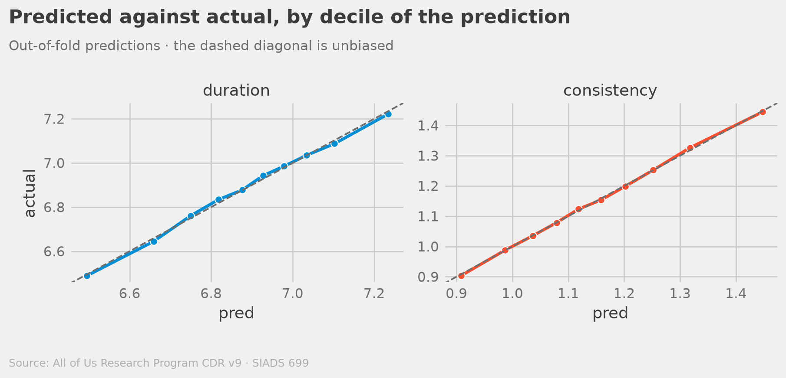

*Figure A2. Out-of-fold predictions against actuals, by decile of the prediction. The largest decile
gap is 0.009 hours on consistency and 0.016 hours on duration.*

Neither gap is remotely large enough to account for the unexplained variance. That is what licenses
the body's claim that the modest R² reflects absent determinants rather than avoidable bias.

### A.5 Choosing *k*

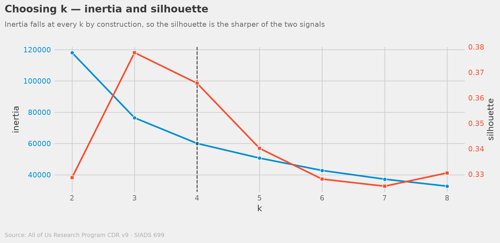

*Figure A3. Inertia and silhouette across k = 2 to 8. Silhouette peaks at k = 3 (0.378) with k = 4
close behind (0.366); inertia shows no sharp elbow.*

We take *k* = 4 for the extra split rather than because the diagnostics demand it. At *k* = 3 the
short sleepers form one group; at *k* = 4 they separate into a regular and a variable one.

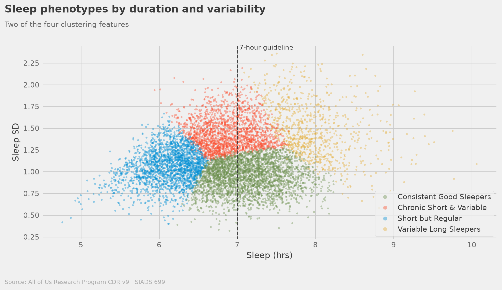

*Figure A4. Two of the four clustering features, colored by assigned phenotype. There are no gaps
between the groups.*

KMeans imposes spherical, equal-variance groups on what Figure A4 shows to be one continuous cloud, so a participant near a boundary is not meaningfully in either group. The clusters describe measured behavior over the tracked window, not cause. And three of the four clustering features are functions of the same nightly distribution, so the solution is close to a two-dimensional summary of duration and variability.

### A.6 Why there is no UBR contrast

*All of Us* defines Underrepresented in Biomedical Research across race/ethnicity, age, sex, gender
identity, sexual orientation, income, education, disability, and geography. Our extract carries only
some of those, so a UBR label derived from it is not the program's UBR variable and should not be reported under that name. The fairness
analysis stratifies by `race_ethnicity` and `age_band` directly, which is what the frame actually knows.

---

## Appendix B — Data flow

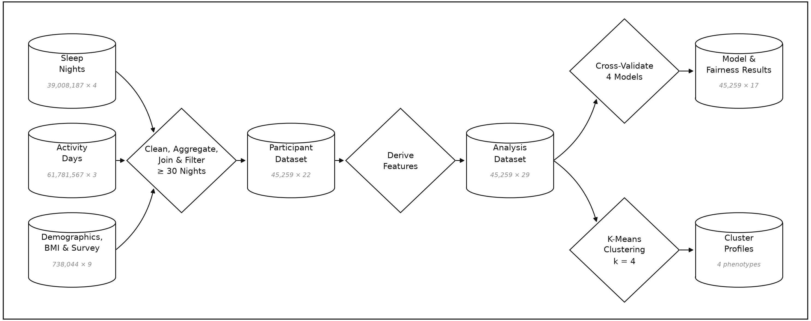

*Figure A5. How data moves from the CDR to the published artifacts. The shapes shown are taken from the printed outputs of the two notebooks.*

---

## Appendix C — AI use statement

AI assistance was used in two distinct roles on this project:

- **Analysis and codebase** — Claude Code as a coding and review assistant across codebase, documentation, and deliverables.
- **Repository setup, hygiene, and deployment** — Antigravity as an agentic assistant for
  project structure, setup and preprocessing documentation, debugging, `.gitignore` rules, and the
  automated pre-push cleanup path.

No model had access to the Controlled Tier environment on the All of Us Workbench. Any AI-assisted work happened outside the Controlled Tier, on code and documentation.

### AI Workflow — analysis and codebase

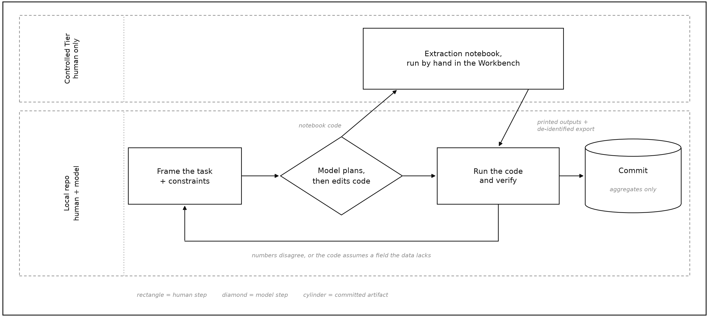

*Figure A6. The AI-assisted workflow and the Controlled Tier boundary.*

Work proceeded in short, scoped sessions each one a loop of the same steps. A task was framed by hand, with explicit limits on what could change. The model proposed a plan before editing anything, and that plan was approved or redirected by hand. Only then did edits go into the repo. The code was run and the output checked against something independent of the model; anything that failed that check was refined, which is where most of the corrections during the re-analysis came from.

The model was also used for the drafting pass on `README.md`, updating numbers and figures downstream in the deliverables, and always re-checked against the executed notebook.

### Workflow — repository setup and hygiene

The second strand sat entirely in the top-left of Figure A6's local lane, before and after the
analysis loop rather than inside it. An agentic assistant was used to:

- Propose the initial project structure and read through the setup and preprocessing documentation;
- Debug outside the sandbox. the Workbench code itself was never touched by an agent, so problems
  were reproduced and fixed locally and the fix carried in by hand;
- Write and maintain the `.gitignore`
- Automate the push-to-GitHub cleanup path, including an attempted automated scan for participant
  data reaching the public repo.

### Models and settings

| | Analysis and codebase | Repository setup and hygiene |
|---|---|---|
| **Interface** | Claude Code (Anthropic), repo-scoped, edits applied under per-action approval | Antigravity (agentic IDE) |
| **Model** | **Claude Opus 5** (`claude-opus-5`) for all development work | Not recorded |
| **Settings** | `effortLevel: "high"` (Claude Code setting), extended thinking enabled | Not recorded |

### How prompts were composed

In the analysis strand, prompts followed a consistent four-part shape:

1. **Orient** — point the model at the authoritative state in the repo rather than describing it.
2. **State the task** in one sentence.
3. **Constrain** — name what must not change.
4. **Require a plan, and invite a question** — "generate a plan", "ask if uncertain about anything".

An actual prompt, from the session that reviewed and simplified the analysis notebook and `src/`:

> Review the project repo. The task is to review code for consistency, readability,
> organization, and simplification. Run this review for the analysis notebook and the files in src
> folder. Generate a plan to cleanup, reduce redundancy, simplify, and organize. Favor readability
> over all. Ask if uncertain about anything.

Follow-ups were terse and itemized, correcting the plan rather than restating the task.

### How output was evaluated

Four checks were applied as a matter of course:

- Notebooks were re-executed end to end and the reported values
  read out of executed cell outputs, never from the model's summary of them.
- Numbers were reconciled across surfaces. All eight dashboard CSVs were cross-checked against the notebook's own stored cell outputs, every published surface was searched for the claims the re-analysis retired, and all five dashboard pages were opened and read.
- Where the re-analysis disagreed with an earlier write-up, the disagreement was recorded and re-measured rather than quietly reconciled.
- Agent-written ignore rules and the automated pre-push cleanup were treated as a first pass.
